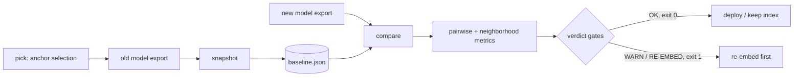

# vecdrift

[English](README.md) | [中文](README.zh.md) | [日本語](README.ja.md)

[](LICENSE) [](CHANGELOG.md) [](pyproject.toml)  [](CONTRIBUTING.md)

**オープンソースの embedding ドリフト検出器：モデルバージョン間のアンカーペア幾何チェック——完全オフライン、エクスポート済みベクトルの上で動き、「再埋め込みすべきか否か」の判定で終わる。**


```bash
git clone https://github.com/JaydenCJ/vecdrift && cd vecdrift && pip install -e .
```

> **プレリリース：** vecdrift はまだ PyPI に公開されていません。最初のリリースまでは [JaydenCJ/vecdrift](https://github.com/JaydenCJ/vecdrift) をクローンし、リポジトリのルートで `pip install -e .` を実行してください。

## なぜ vecdrift か？

Embedding モデルの更新はベクトル検索を音もなく壊します。新しいモデルはすべての文書に別の座標を返し、インデックスは何事もなくクエリに応答し続け、ユーザーがリコールの悪化を訴えるまで誰も気づきません。二つのモデルの生ベクトルは直接比較できません——次元が違い、回転も任意——ので、バージョンをまたいだ場当たり的な cosine チェックは無意味です。比較できるのは相対幾何、つまり同じアンカー文書同士が今も近くにいるかどうかです。vecdrift は固定アンカー集合のその幾何を Git にコミットできる小さなベースラインとして凍結し、以後のどのエクスポートもそれで採点します——ペア類似度の相関、近傍 overlap@k、最悪アンカーの名指し——そしてモデル切り替え前に唯一重要な問いに答えます：再埋め込みするか、しないか。embedding API は一切呼ばず、ベクトル DB にも触れません：エクスポート済みベクトルが入力、判定と終了コードが出力です。

|  | vecdrift | Evidently | Arize Phoenix | Ragas | 自作 cosine スクリプト |
|---|---|---|---|---|---|
| *異なる* embedding モデルを比較（任意次元） | 可 | 不可（同一空間の経時変化） | 不可（同一空間） | 間接的（回答品質） | 不可 |
| エクスポート済みベクトルでオフライン動作 | 可 | 可 | サーバー + UI 必須 | LLM API 必須 | 可 |
| 再埋め込み判定 + CI 終了コード | 可 | レポートのみ | ダッシュボードのみ | スコアのみ | 自分で書く |
| ドリフト最悪の文書を名指し | 可 | 不可 | 可視化（UMAP） | 不可 | 自分で書く |
| コミット可能なベースライン、旧ベクトルは削除可 | 可 | 不可 | 不可 | 不可 | 不可 |
| ランタイム依存 | 0 | 20+ | 40+ | 10+（judge モデル別途） | 0–1 |

<sub>依存数は 2026-07 時点で各パッケージが PyPI 上で宣言するランタイム要件：evidently 0.7.x（20+、pandas/scikit-learn 含む）、arize-phoenix 11.x（40+）、ragas 0.3.x（10+、加えて LLM プロバイダ SDK）。vecdrift の数字は [pyproject.toml](pyproject.toml) の `dependencies = []` です。</sub>

## 特徴

- **モデル横断・次元横断の比較** — アンカーペアの cosine 構造で幾何を比較するため、回転・一様スケール・次元変更の影響を受けない。dim-384 のベースラインが dim-1536 の候補を位置合わせなしで採点できる。
- **ダッシュボードではなく判定** — 境界含みの三段ゲート（`OK` / `WARN` / `RE-EMBED`）が失敗ゲートごとの理由付きで出て、終了コードはそのまま CI に入る。しきい値はすべて `--ok-*` / `--warn-*` でコーパスごとに上書き可能。
- **リコールに直結する指標** — 各アンカーの top-k 近傍の overlap@k は検索リコールの直接的な代理指標。順位変動、Pearson/Spearman 構造相関、該当ペアを名指しする平均/最大類似度差分が裏付ける。
- **最悪アンカーを名指し** — 近傍が壊れた具体的な文書をレポートが順位付けし、「モデルがドリフトした」を「まずこの 5 文書を確認」に変える。
- **コミットできるベースライン** — `snapshot` は id・ノルム・丸め済み圧縮類似度行列だけを保存（アンカー 256 個で約 33 KB）。旧ベクトルを消しても数か月後に比較できる（[フォーマット文書](docs/baseline-format.md)）。
- **バイト単位で決定的** — 近傍のタイはアンカー id で解決、アンカー選定は乱数シードなしの最遠点サンプリング、JSON 出力はキーソート済み。二台のマシンが同一のレポートを出す。
- **ランタイム依存ゼロ、完全オフライン** — 純粋な Python 標準ライブラリのみ。ベクトル DB 接続なし、embedding API 呼び出しなし、テレメトリなし。入れるのはこのパッケージだけ。

## クイックスタート

インストールして、同梱の合成エクスポート（48 文書、3 つの「モデルバージョン」）を生成します：

```bash
git clone https://github.com/JaydenCJ/vecdrift && cd vecdrift && pip install -e .
python3 examples/generate_exports.py demo && cd demo
```

現行モデルの幾何を凍結し、行儀のよいアップグレード（回転 + 再スケール、幾何は不変）を採点します：

```bash
vecdrift snapshot model_v1.jsonl -o baseline.json --label model-v1
vecdrift compare baseline.json model_v2.jsonl
```

```text
vecdrift: model-v1 (48 anchors, dim 8) vs model_v2 (48 anchors, dim 8)
matched anchors : 48 (0 missing from candidate, 0 extra)

pairwise geometry
  similarity correlation (pearson)  : 1.0000
  similarity correlation (spearman) : 1.0000
  mean |delta similarity|           : 0.0010
  max  |delta similarity|           : 0.0042  (doc-14 vs doc-24)

neighborhoods (k=10)
  mean overlap@10  : 1.000
  min  overlap@10  : 1.000  (doc-00)
  mean rank shift  : 0.01

vector norms (same dim, comparable)
  baseline  mean 1.2570  std 0.2125
  candidate mean 2.1366  std 0.3613

verdict: OK
```

次にドリフトするアップグレード（dim 12、10 文書がクラスタ帰属を喪失）を採点——出力は要点のみ抜粋：

```bash
vecdrift compare baseline.json model_v3.jsonl
```

```text
vecdrift: model-v1 (48 anchors, dim 8) vs model_v3 (48 anchors, dim 12)
...
neighborhoods (k=10)
  mean overlap@10  : 0.665
  min  overlap@10  : 0.100  (doc-11)
  mean rank shift  : 6.65

worst anchors
  doc-39               overlap 0.10  rank shift 21.9  mean |dsim| 0.5582
  doc-11               overlap 0.10  rank shift 12.2  mean |dsim| 0.4607
  doc-35               overlap 0.20  rank shift 17.6  mean |dsim| 0.5439
  doc-27               overlap 0.20  rank shift 16.5  mean |dsim| 0.5364
  doc-31               overlap 0.20  rank shift 13.6  mean |dsim| 0.5048

verdict: RE-EMBED
  - mean neighborhood overlap 0.665 < warn threshold 0.800
  - pairwise similarity correlation 0.6513 < warn threshold 0.9700
  - mean |delta similarity| 0.1582 > warn threshold 0.0500
  re-embed the corpus before switching models; recall will change.
```

終了コードは 1。つまりこのコマンドがそのまま CI ゲート*になります*。上の二つの出力はどちらも実行結果の実写です（ビット単位で再現可能——サンプル生成器はシード固定）。大きなコーパスではまず多様なアンカー部分集合を選びます：`vecdrift pick full_export.jsonl -n 128 -o anchors.jsonl`。

## コマンドと終了コード

| コマンド | 目的 |
|---|---|
| `vecdrift snapshot <export> -o baseline.json [--label L]` | エクスポートのアンカー幾何をバージョン付きベースラインとして凍結 |
| `vecdrift compare <baseline\|export> <export> [-k N] [--json] [--fail-on never\|warn\|re-embed]` | 参照で候補を採点。どちら側にも生エクスポートを渡せる |
| `vecdrift inspect <export> [--dupes N]` | 健全性チェック：件数、次元、ノルム分布、重複疑いペア |
| `vecdrift pick <export> -n N -o anchors.jsonl` | 決定的な最遠点サンプリングで多様なアンカー部分集合を選定 |

対応エクスポート形式：`.jsonl`/`.ndjson`（各行 `{"id": ..., "vector": [...]}`、余分なキーは無視）、`.json`（リスト、`"vectors"` キー、または id→ベクトルのマップ）、`.csv`（ヘッダー `id,v0,v1,...`）。終了コード：**0** 合格、**1** `--fail-on` 水準（既定 `re-embed`）以上のドリフト、**2** 用法または入力エラー。

## 判定ゲート

| キー | 既定値 | 効果 |
|---|---|---|
| `--ok-overlap` | `0.95` | `OK` に必要な平均 overlap@k の下限 |
| `--ok-correlation` | `0.995` | `OK` に必要なペア類似度 Pearson の下限 |
| `--ok-delta` | `0.02` | `OK` に許される平均 \|Δ 類似度\| の上限 |
| `--warn-overlap` | `0.80` | `WARN` に必要な平均 overlap@k の下限。未満 ⇒ `RE-EMBED` |
| `--warn-correlation` | `0.97` | `WARN` に必要な Pearson の下限。未満 ⇒ `RE-EMBED` |
| `--warn-delta` | `0.05` | `WARN` に許される平均 \|Δ 類似度\| の上限。超過 ⇒ `RE-EMBED` |

ゲートは境界を含みます。分散ゼロ（未定義）の相関がそれ単独でゲートを落とすことはありません。指標の定義と既定値の根拠は [docs/metrics.md](docs/metrics.md) にあります。

## 検証

このリポジトリは CI を一切同梱しません。上記の主張はすべてローカル実行で検証されています。このリポジトリのチェックアウトから再現できます：

```bash
pip install -e '.[dev]' && pytest && bash scripts/smoke.sh
```

出力（実際の実行からの転載、`...` で省略）：

```text
91 passed in 0.94s
...
[compare-drift] verdict: RE-EMBED
SMOKE OK
```

## アーキテクチャ



## ロードマップ

- [x] 幾何エンジン、3 種のエクスポートローダー、バージョン付きベースライン、段階判定つき compare、`inspect`/`pick`、JSON レポート（v0.1.0）
- [ ] PyPI 公開（`pip install vecdrift`）
- [ ] 一括エクスポート向けの `.npy`/`.parquet` ローダー
- [ ] 非対称アンカーペア（クエリ→文書）による検索形状のチェック
- [ ] PR コメントに貼れる Markdown ドリフトレポート成果物
- [ ] マルチスナップショットのタイムライン：多数のモデルバージョンにわたるドリフト追跡

全リストは [open issues](https://github.com/JaydenCJ/vecdrift/issues) を参照してください。

## コントリビュート

貢献を歓迎します——まずは [good first issue](https://github.com/JaydenCJ/vecdrift/issues?q=is%3Aissue+is%3Aopen+label%3A%22good+first+issue%22) から、あるいは [discussion](https://github.com/JaydenCJ/vecdrift/discussions) を立ててください。開発環境の構築は [CONTRIBUTING.md](CONTRIBUTING.md) を参照。

## ライセンス

[MIT](LICENSE)
