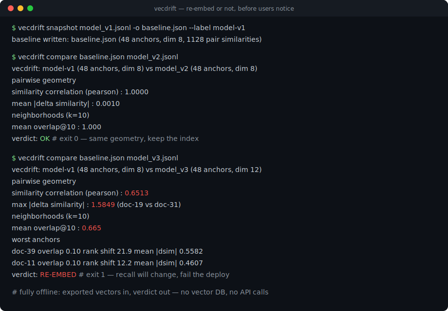
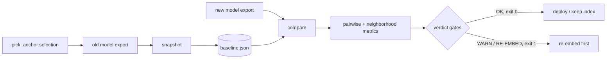

# vecdrift

[English](README.md) | [中文](README.zh.md) | [日本語](README.ja.md)

[](LICENSE) [](CHANGELOG.md) [](pyproject.toml)  [](CONTRIBUTING.md)

**Open-source embedding-drift detector: anchor-pair geometry checks across model versions — offline, over exported vectors, ending in a re-embed-or-not verdict.**



```bash
git clone https://github.com/JaydenCJ/vecdrift && cd vecdrift && pip install -e .
```

> **Pre-release:** vecdrift is not yet published to PyPI. Until the first release, clone [JaydenCJ/vecdrift](https://github.com/JaydenCJ/vecdrift) and run `pip install -e .` from the repository root.

## Why vecdrift?

Embedding model upgrades break vector search silently: the new model returns different coordinates for every document, your index still answers queries, and nobody notices until users complain about recall. Raw vectors from two models can never be compared directly — different dimensions, arbitrary rotations — so ad-hoc cosine spot checks are meaningless across versions. What *is* comparable is relative geometry: whether the same anchor documents are still close to the same anchor documents. vecdrift freezes that geometry from a fixed anchor set into a small committable baseline, then grades any later export against it — pairwise-similarity correlation, neighborhood overlap@k, worst-anchor naming — and answers the only question that matters before a model switch: re-embed, or not. It never calls an embedding API and never touches your vector database: exported vectors in, verdict and exit code out.

|  | vecdrift | Evidently | Arize Phoenix | Ragas | DIY cosine script |
|---|---|---|---|---|---|
| Compares *different* embedding models (any dims) | Yes | No (one space over time) | No (one space) | Indirect (answer quality) | No |
| Runs offline on exported vectors | Yes | Yes | Server + UI | Needs LLM API | Yes |
| Re-embed verdict + CI exit code | Yes | Report only | Dashboard only | Scores only | You write it |
| Names the worst-drifted documents | Yes | No | Visual (UMAP) | No | You write it |
| Committable baseline, old vectors deletable | Yes | No | No | No | No |
| Runtime dependencies | 0 | 20+ | 40+ | 10+ (plus a judge model) | 0–1 |

<sub>Dependency counts are the declared runtime requirements on PyPI as of 2026-07: evidently 0.7.x (20+ incl. pandas/scikit-learn), arize-phoenix 11.x (40+), ragas 0.3.x (10+ plus an LLM provider SDK). vecdrift's count is `dependencies = []` in [pyproject.toml](pyproject.toml).</sub>

## Features

- **Cross-model, cross-dimension comparison** — geometry is compared through anchor-pair cosine structure, which survives rotation, uniform scaling, and dimension changes; a dim-384 baseline grades a dim-1536 candidate without any alignment step.
- **A verdict, not a dashboard** — three inclusive gate tiers (`OK` / `WARN` / `RE-EMBED`) with per-gate reasons and a CI-ready exit code; every threshold is overridable per corpus via `--ok-*` / `--warn-*` flags.
- **Recall-shaped metrics** — overlap@k of each anchor's top-k neighborhood is a direct proxy for retrieval recall, backed by rank-shift, Pearson/Spearman structure correlation, and mean/max similarity deltas with the offending pair named.
- **Worst anchors named** — the report ranks the concrete documents whose neighborhoods broke, so "the model drifted" becomes "spot-check these five documents first".
- **Committable baselines** — `snapshot` stores ids, norms, and the rounded condensed similarity matrix (~33 KB for 256 anchors); delete the old vectors and still compare months later ([format doc](docs/baseline-format.md)).
- **Deterministic to the byte** — neighbor ties break by anchor id, anchor picking is seeded-RNG-free farthest-point sampling, and JSON output has sorted keys; two machines produce identical reports.
- **Zero runtime dependencies, fully offline** — pure Python stdlib; no vector DB connection, no embedding API calls, no telemetry, nothing to install but the package itself.

## Quickstart

Install and generate the bundled synthetic exports (48 documents, three "model versions"):

```bash
git clone https://github.com/JaydenCJ/vecdrift && cd vecdrift && pip install -e .
python3 examples/generate_exports.py demo && cd demo
```

Freeze the current model's geometry, then grade a well-behaved upgrade (rotated + rescaled, same geometry):

```bash
vecdrift snapshot model_v1.jsonl -o baseline.json --label model-v1
vecdrift compare baseline.json model_v2.jsonl
```

```text
vecdrift: model-v1 (48 anchors, dim 8) vs model_v2 (48 anchors, dim 8)
matched anchors : 48 (0 missing from candidate, 0 extra)

pairwise geometry
  similarity correlation (pearson)  : 1.0000
  similarity correlation (spearman) : 1.0000
  mean |delta similarity|           : 0.0010
  max  |delta similarity|           : 0.0042  (doc-14 vs doc-24)

neighborhoods (k=10)
  mean overlap@10  : 1.000
  min  overlap@10  : 1.000  (doc-00)
  mean rank shift  : 0.01

vector norms (same dim, comparable)
  baseline  mean 1.2570  std 0.2125
  candidate mean 2.1366  std 0.3613

verdict: OK
```

Now grade a drifting upgrade (dim 12, ten documents lost their cluster identity) — output truncated to the interesting part:

```bash
vecdrift compare baseline.json model_v3.jsonl
```

```text
vecdrift: model-v1 (48 anchors, dim 8) vs model_v3 (48 anchors, dim 12)
...
neighborhoods (k=10)
  mean overlap@10  : 0.665
  min  overlap@10  : 0.100  (doc-11)
  mean rank shift  : 6.65

worst anchors
  doc-39               overlap 0.10  rank shift 21.9  mean |dsim| 0.5582
  doc-11               overlap 0.10  rank shift 12.2  mean |dsim| 0.4607
  doc-35               overlap 0.20  rank shift 17.6  mean |dsim| 0.5439
  doc-27               overlap 0.20  rank shift 16.5  mean |dsim| 0.5364
  doc-31               overlap 0.20  rank shift 13.6  mean |dsim| 0.5048

verdict: RE-EMBED
  - mean neighborhood overlap 0.665 < warn threshold 0.800
  - pairwise similarity correlation 0.6513 < warn threshold 0.9700
  - mean |delta similarity| 0.1582 > warn threshold 0.0500
  re-embed the corpus before switching models; recall will change.
```

The exit code is 1, so the same command *is* the CI gate. Both outputs above are real captured runs (reproducible bit-for-bit — the example generator is seeded). For a large corpus, pick a diverse anchor subset first: `vecdrift pick full_export.jsonl -n 128 -o anchors.jsonl`.

## Commands and exit codes

| Command | Purpose |
|---|---|
| `vecdrift snapshot <export> -o baseline.json [--label L]` | Freeze an export's anchor geometry into a versioned baseline file |
| `vecdrift compare <baseline\|export> <export> [-k N] [--json] [--fail-on never\|warn\|re-embed]` | Grade a candidate against a reference; either side may be a raw export |
| `vecdrift inspect <export> [--dupes N]` | Sanity stats: count, dim, norm distribution, near-duplicate pairs |
| `vecdrift pick <export> -n N -o anchors.jsonl` | Deterministic farthest-point selection of a diverse anchor subset |

Accepted export formats: `.jsonl`/`.ndjson` (`{"id": ..., "vector": [...]}` per line, extra keys ignored), `.json` (list, `"vectors"` key, or id-to-vector mapping), `.csv` (header `id,v0,v1,...`). Exit codes: **0** pass, **1** drift at or above `--fail-on` (default `re-embed`), **2** usage or input error.

## Verdict gates

| Key | Default | Effect |
|---|---|---|
| `--ok-overlap` | `0.95` | Minimum mean overlap@k for `OK` |
| `--ok-correlation` | `0.995` | Minimum pairwise-similarity Pearson for `OK` |
| `--ok-delta` | `0.02` | Maximum mean \|Δ similarity\| for `OK` |
| `--warn-overlap` | `0.80` | Minimum mean overlap@k for `WARN`; below ⇒ `RE-EMBED` |
| `--warn-correlation` | `0.97` | Minimum Pearson for `WARN`; below ⇒ `RE-EMBED` |
| `--warn-delta` | `0.05` | Maximum mean \|Δ similarity\| for `WARN`; above ⇒ `RE-EMBED` |

Gates are inclusive; a zero-variance (undefined) correlation never fails a gate by itself. The metric definitions and the reasoning behind the defaults live in [docs/metrics.md](docs/metrics.md).

## Verification

This repository ships no CI; every claim above is verified by local runs. Reproduce them from a checkout of this repository:

```bash
pip install -e '.[dev]' && pytest && bash scripts/smoke.sh
```

Output (copied from a real run, truncated with `...`):

```text
91 passed in 0.94s
...
[compare-drift] verdict: RE-EMBED
SMOKE OK
```

## Architecture



## Roadmap

- [x] Geometry engine, three export loaders, versioned baselines, compare with graded verdict, `inspect`/`pick`, JSON reports (v0.1.0)
- [ ] PyPI release with `pip install vecdrift`
- [ ] `.npy`/`.parquet` loaders for bulk exports
- [ ] Asymmetric anchor pairs (query→document) for retrieval-shaped checks
- [ ] Markdown drift-report artifact for PR comments
- [ ] Multi-snapshot timeline: track drift across many model versions

See the [open issues](https://github.com/JaydenCJ/vecdrift/issues) for the full list.

## Contributing

Contributions are welcome — start with a [good first issue](https://github.com/JaydenCJ/vecdrift/issues?q=is%3Aissue+is%3Aopen+label%3A%22good+first+issue%22) or open a [discussion](https://github.com/JaydenCJ/vecdrift/discussions). See [CONTRIBUTING.md](CONTRIBUTING.md) for the development setup.

## License

[MIT](LICENSE)
