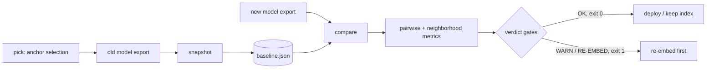

# vecdrift

[English](README.md) | [中文](README.zh.md) | [日本語](README.ja.md)

[](LICENSE) [](CHANGELOG.md) [](pyproject.toml)  [](CONTRIBUTING.md)

**开源的 embedding 漂移检测器：跨模型版本的锚点对几何检查——完全离线、基于导出向量，最终给出"要不要重新嵌入"的裁决。**


```bash
git clone https://github.com/JaydenCJ/vecdrift && cd vecdrift && pip install -e .
```

> **预发布：** vecdrift 尚未发布到 PyPI。在首个正式版本之前，请克隆 [JaydenCJ/vecdrift](https://github.com/JaydenCJ/vecdrift) 并在仓库根目录运行 `pip install -e .`。

## 为什么选 vecdrift？

Embedding 模型升级会悄无声息地破坏向量搜索：新模型为每个文档返回完全不同的坐标，索引照常应答查询，直到用户抱怨召回变差才有人发现。两个模型的原始向量根本无法直接比较——维度不同、旋转任意——因此跨版本做零散的 cosine 抽查毫无意义。真正可比的是相对几何：同一批锚点文档是否仍然彼此靠近。vecdrift 把固定锚点集的这份几何冻结成一个可提交进 Git 的小型基线，然后用它给任何后续导出打分——成对相似度相关性、邻域 overlap@k、点名最差锚点——并回答切换模型前唯一重要的问题：重新嵌入，还是不用。它从不调用 embedding API，也从不碰你的向量数据库：导出向量进，裁决与退出码出。

|  | vecdrift | Evidently | Arize Phoenix | Ragas | 自写 cosine 脚本 |
|---|---|---|---|---|---|
| 比较*不同的* embedding 模型（任意维度） | 是 | 否（同一空间随时间） | 否（同一空间） | 间接（答案质量） | 否 |
| 离线跑在导出向量上 | 是 | 是 | 需服务端 + UI | 需 LLM API | 是 |
| 重嵌裁决 + CI 退出码 | 是 | 仅报告 | 仅仪表盘 | 仅分数 | 得自己写 |
| 点名漂移最严重的文档 | 是 | 否 | 可视化（UMAP） | 否 | 得自己写 |
| 可提交的基线，旧向量可删除 | 是 | 否 | 否 | 否 | 否 |
| 运行时依赖 | 0 | 20+ | 40+ | 10+（外加评审模型） | 0–1 |

<sub>依赖数为 2026-07 时各包在 PyPI 上声明的运行时依赖：evidently 0.7.x（20+，含 pandas/scikit-learn）、arize-phoenix 11.x（40+）、ragas 0.3.x（10+，外加某家 LLM SDK）。vecdrift 的数字来自 [pyproject.toml](pyproject.toml) 中的 `dependencies = []`。</sub>

## 特性

- **跨模型、跨维度比较** — 通过锚点对的 cosine 结构比较几何，天然不受旋转、统一缩放和维度变化影响；dim-384 的基线可以直接给 dim-1536 的候选打分，无需任何对齐步骤。
- **给裁决，不给仪表盘** — 三档含边界的门限（`OK` / `WARN` / `RE-EMBED`），每个失败门限都有理由说明，退出码可直接进 CI；所有阈值都可用 `--ok-*` / `--warn-*` 按语料覆盖。
- **贴近召回的指标** — 每个锚点 top-k 邻域的 overlap@k 是检索召回的直接代理，辅以排名位移、Pearson/Spearman 结构相关性，以及点名具体文档对的平均/最大相似度变化。
- **点名最差锚点** — 报告按邻域破坏程度排出具体文档，让"模型漂了"变成"先抽查这五个文档"。
- **可提交的基线** — `snapshot` 只存 id、范数和舍入后的压缩相似度矩阵（256 个锚点约 33 KB）；删掉旧向量，数月后仍能比较（[格式文档](docs/baseline-format.md)）。
- **逐字节确定性** — 邻居平手按锚点 id 决胜，锚点挑选是无随机种子的最远点采样，JSON 输出按键排序；两台机器产出完全一致的报告。
- **零运行时依赖、完全离线** — 纯 Python 标准库；不连向量数据库、不调 embedding API、无遥测，除了包本身什么都不用装。

## 快速上手

安装并生成内置的合成导出（48 个文档，三个"模型版本"）：

```bash
git clone https://github.com/JaydenCJ/vecdrift && cd vecdrift && pip install -e .
python3 examples/generate_exports.py demo && cd demo
```

冻结当前模型的几何，然后给一次表现良好的升级打分（旋转 + 重缩放，几何不变）：

```bash
vecdrift snapshot model_v1.jsonl -o baseline.json --label model-v1
vecdrift compare baseline.json model_v2.jsonl
```

```text
vecdrift: model-v1 (48 anchors, dim 8) vs model_v2 (48 anchors, dim 8)
matched anchors : 48 (0 missing from candidate, 0 extra)

pairwise geometry
  similarity correlation (pearson)  : 1.0000
  similarity correlation (spearman) : 1.0000
  mean |delta similarity|           : 0.0010
  max  |delta similarity|           : 0.0042  (doc-14 vs doc-24)

neighborhoods (k=10)
  mean overlap@10  : 1.000
  min  overlap@10  : 1.000  (doc-00)
  mean rank shift  : 0.01

vector norms (same dim, comparable)
  baseline  mean 1.2570  std 0.2125
  candidate mean 2.1366  std 0.3613

verdict: OK
```

再给一次漂移的升级打分（dim 12，十个文档丢失了聚类归属）——输出截取关键部分：

```bash
vecdrift compare baseline.json model_v3.jsonl
```

```text
vecdrift: model-v1 (48 anchors, dim 8) vs model_v3 (48 anchors, dim 12)
...
neighborhoods (k=10)
  mean overlap@10  : 0.665
  min  overlap@10  : 0.100  (doc-11)
  mean rank shift  : 6.65

worst anchors
  doc-39               overlap 0.10  rank shift 21.9  mean |dsim| 0.5582
  doc-11               overlap 0.10  rank shift 12.2  mean |dsim| 0.4607
  doc-35               overlap 0.20  rank shift 17.6  mean |dsim| 0.5439
  doc-27               overlap 0.20  rank shift 16.5  mean |dsim| 0.5364
  doc-31               overlap 0.20  rank shift 13.6  mean |dsim| 0.5048

verdict: RE-EMBED
  - mean neighborhood overlap 0.665 < warn threshold 0.800
  - pairwise similarity correlation 0.6513 < warn threshold 0.9700
  - mean |delta similarity| 0.1582 > warn threshold 0.0500
  re-embed the corpus before switching models; recall will change.
```

退出码为 1，所以这条命令本身*就是* CI 门禁。上面两段输出都是真实运行捕获的（可逐字节复现——示例生成器带固定种子）。语料很大时先挑一个多样化的锚点子集：`vecdrift pick full_export.jsonl -n 128 -o anchors.jsonl`。

## 命令与退出码

| 命令 | 用途 |
|---|---|
| `vecdrift snapshot <export> -o baseline.json [--label L]` | 把一次导出的锚点几何冻结为带版本号的基线文件 |
| `vecdrift compare <baseline\|export> <export> [-k N] [--json] [--fail-on never\|warn\|re-embed]` | 用参照给候选打分；两侧都可以直接传原始导出 |
| `vecdrift inspect <export> [--dupes N]` | 体检统计：数量、维度、范数分布、疑似重复对 |
| `vecdrift pick <export> -n N -o anchors.jsonl` | 确定性最远点采样，挑出多样化锚点子集 |

支持的导出格式：`.jsonl`/`.ndjson`（每行 `{"id": ..., "vector": [...]}`，多余键忽略）、`.json`（列表、`"vectors"` 键或 id 到向量的映射）、`.csv`（表头 `id,v0,v1,...`）。退出码：**0** 通过，**1** 漂移达到 `--fail-on` 级别（默认 `re-embed`），**2** 用法或输入错误。

## 裁决门限

| 键 | 默认值 | 作用 |
|---|---|---|
| `--ok-overlap` | `0.95` | 判 `OK` 所需的最低平均 overlap@k |
| `--ok-correlation` | `0.995` | 判 `OK` 所需的最低成对相似度 Pearson |
| `--ok-delta` | `0.02` | 判 `OK` 允许的最高平均 \|Δ 相似度\| |
| `--warn-overlap` | `0.80` | 判 `WARN` 所需的最低平均 overlap@k；更低 ⇒ `RE-EMBED` |
| `--warn-correlation` | `0.97` | 判 `WARN` 所需的最低 Pearson；更低 ⇒ `RE-EMBED` |
| `--warn-delta` | `0.05` | 判 `WARN` 允许的最高平均 \|Δ 相似度\|；更高 ⇒ `RE-EMBED` |

门限包含边界；方差为零（无定义）的相关性本身永远不会判失败。指标定义与默认值的推导见 [docs/metrics.md](docs/metrics.md)。

## 验证

本仓库不带任何 CI；以上所有断言均由本地运行验证。在本仓库的检出中即可复现：

```bash
pip install -e '.[dev]' && pytest && bash scripts/smoke.sh
```

输出（摘自真实运行，用 `...` 截断）：

```text
91 passed in 0.94s
...
[compare-drift] verdict: RE-EMBED
SMOKE OK
```

## 架构



## 路线图

- [x] 几何引擎、三种导出加载器、带版本的基线、分级裁决的 compare、`inspect`/`pick`、JSON 报告（v0.1.0）
- [ ] 发布到 PyPI，支持 `pip install vecdrift`
- [ ] 面向批量导出的 `.npy`/`.parquet` 加载器
- [ ] 非对称锚点对（查询→文档），做更贴近检索形态的检查
- [ ] 可贴进 PR 评论的 Markdown 漂移报告产物
- [ ] 多快照时间线：跨多个模型版本追踪漂移

完整列表见 [open issues](https://github.com/JaydenCJ/vecdrift/issues)。

## 参与贡献

欢迎贡献——可以从 [good first issue](https://github.com/JaydenCJ/vecdrift/issues?q=is%3Aissue+is%3Aopen+label%3A%22good+first+issue%22) 入手，或发起一个 [discussion](https://github.com/JaydenCJ/vecdrift/discussions)。开发环境搭建见 [CONTRIBUTING.md](CONTRIBUTING.md)。

## 许可证

[MIT](LICENSE)
